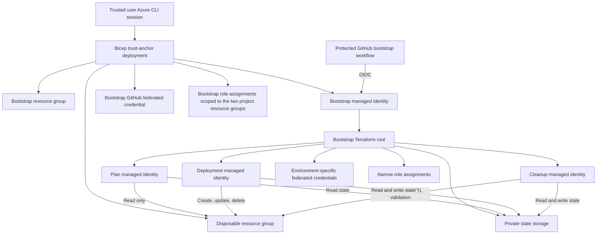

# Implementation Plan

## Purpose

This document is the authoritative resume point for building the project. Update the progress checklist and decision log whenever a phase completes or the design changes.

The goal is to deploy and destroy an ephemeral AKS learning cluster through GitHub Actions using Terraform, GitHub OIDC, four least-privilege Azure identities, and no client secrets. The initial trust anchor must require as little manual work as Azure and GitHub security allow.

## Current checkpoint

Last reviewed: 2026-08-14

- [x] Public GitHub repository created.
- [x] GitHub account email privacy, 2FA, session, application, token, and profile settings reviewed.
- [x] Repository Actions and code-security settings hardened.
- [x] Local Git author uses the GitHub `noreply` address.
- [x] Local branch is `dev`; foundation commit `7f7e13e` is pushed to `origin/dev`.
- [x] Terraform 1.15.8 installed locally.
- [x] Terraform basics exercise created and validated without Azure resources.
- [x] Personal Azure context selected: `Visual Studio Enterprise Subscription`.
- [x] Deployment region selected: `swedencentral`.
- [x] AKS node SKU selected: `Standard_D2as_v5` with one node.
- [x] Sweden Central quota verified: 20 total regional vCPUs and 20 DASv5-family vCPUs available.
- [x] Trust-anchor Bicep deployed to the personal subscription; provisioning state Succeeded.
- [x] Azure project resources created: `rg-taks-bootstrap-swc`, `rg-taks-sandbox-swc`, bootstrap managed identity `id-taks-bootstrap-swc`, its GitHub OIDC federated credential, and four resource-group-scoped role assignments.
- [x] `bootstrap` GitHub environment configured with the three OIDC identifiers: `AZURE_CLIENT_ID` and `AZURE_TENANT_ID` as environment variables, `AZURE_SUBSCRIPTION_ID` as an environment secret. Default Actions token verified read-only.

## Fixed decisions

| Area | Decision |
|---|---|
| Repository visibility | Public |
| Infrastructure tool | Terraform |
| Initial trust anchor | Subscription-scope Bicep deployment invoked through the authenticated Azure CLI |
| CI/CD system | GitHub Actions on GitHub-hosted runners |
| Azure authentication | GitHub OIDC workload identity federation; no client secrets or certificates |
| Region | Sweden Central (`swedencentral`) |
| AKS worker | One `Standard_D2as_v5` node |
| AKS control plane | Free tier |
| Default TTL | Four hours |
| Terraform state | Private Azure Blob Storage with Entra ID authorization |
| State lifecycle | Lives with the current Azure subscription; a future subscription receives a new backend and fresh deployment |
| Identity model | Four identities: bootstrap, plan, deployment, and cleanup |
| Apply/destroy model | One deployment identity, separate protected GitHub environments and approvals |
| Pull requests | Offline checks only; no Azure OIDC token |
| Runners | GitHub-hosted only |

## Architecture



## Why one initial action is unavoidable

A new public GitHub repository has no Azure identity. Azure cannot securely allow an unauthenticated workflow to create its own identity or permissions. A trusted Azure user must establish the first trust relationship once.

The initial action will not create a client secret and will not create Terraform state locally. It will submit a declarative Bicep deployment through the already authenticated Azure CLI. Azure Resource Manager records that deployment.

After the trust anchor exists, GitHub Actions creates and manages the remaining infrastructure.

## Resource ownership boundaries

### Trust-anchor Bicep deployment

The minimal Bicep deployment owns only resources that must exist before GitHub can authenticate:

- Bootstrap resource group.
- Disposable AKS resource group.
- Bootstrap user-assigned managed identity.
- Exact GitHub OIDC federated credential for the `bootstrap` environment.
- Bootstrap role assignments scoped only to the two project resource groups.

Creating both resource groups in this layer avoids giving the bootstrap identity subscription-wide `Contributor` access merely so it can create resource groups.

The bootstrap identity needs permission to create resources and role assignments only inside these two project resource groups. It must not receive `Owner` or routine subscription-wide access.

### Bootstrap Terraform root

The `bootstrap/` Terraform root will own persistent resources inside the bootstrap resource group:

- Secure Storage account and private `tfstate` container.
- Plan user-assigned managed identity.
- Deployment user-assigned managed identity.
- Cleanup user-assigned managed identity.
- Federated identity credentials for protected GitHub environments.
- Resource-group and state data-plane role assignments for routine identities.

The bootstrap managed identity itself and the two project resource groups remain owned by the trust-anchor Bicep deployment to avoid a circular dependency.

### Disposable Terraform root

The `infrastructure/` Terraform root will own only short-lived resources in the disposable resource group:

- AKS cluster.
- Disposable networking and supporting resources.
- Managed identities needed by AKS itself.
- Ownership and expiration tags.

Destroying this root must not delete the state backend, GitHub CI identities, or trust-anchor resources.

## Identity and access model

| Identity | GitHub environment | Azure access | State access | Invocation |
|---|---|---|---|---|
| Bootstrap | `bootstrap` | Manage resources and role assignments only in the two project resource groups | Create and administer backend during bootstrap | Manual, protected |
| Plan | `aks-plan` | Reader on disposable resource group | Blob state read | Manual or trusted default-branch plan; not untrusted PR code |
| Deployment | `aks-apply`, `aks-destroy` | Contributor on disposable resource group | Blob state read/write | Manual, protected |
| Cleanup | `ttl-cleanup` | Minimum practical deletion access on disposable resource group | Blob state read/write | Scheduled and manually testable |

Notes:

- Apply and destroy share the deployment identity because Terraform requires the complete resource lifecycle. Separate GitHub environments preserve separate approvals and audit trails.
- The cleanup identity is separate because scheduled cleanup cannot wait for approval.
- `Contributor` does not permit role assignment changes. Routine deployment code must not create Azure role assignments.
- If a built-in role is broader than cleanup requires, evaluate a custom role only after the first working deployment; do not prematurely introduce a custom role.

## OIDC trust requirements

Every federated credential must use:

- Issuer: `https://token.actions.githubusercontent.com`
- Audience: `api://AzureADTokenExchange`
- Exact, case-sensitive subject for one repository and one GitHub environment.
- GitHub immutable owner and repository IDs because the repository was created after 2026-07-15.

Planned environments:

```text
bootstrap
aks-plan
aks-apply
aks-destroy
ttl-cleanup
```

Never guess an OIDC subject. Retrieve the repository's actual immutable subject format and identifiers through GitHub before creating Azure federated credentials.

Only jobs that authenticate to Azure receive:

```yaml
permissions:
  contents: read
  id-token: write
```

Pull request validation jobs receive `contents: read` only.

## GitHub configuration model

The following values are identifiers, not authentication secrets. All three are scoped to the `bootstrap` GitHub environment so they stay behind the environment gate and `dev` branch restriction. They are split by disclosure sensitivity: the two effectively public identifiers are stored as environment variables, and the subscription ID is stored as an environment secret to keep it out of the settings UI.

```text
AZURE_CLIENT_ID        # bootstrap environment variable
AZURE_TENANT_ID        # bootstrap environment variable
AZURE_SUBSCRIPTION_ID  # bootstrap environment secret
```

No environment may contain:

```text
AZURE_CLIENT_SECRET
AZURE_CREDENTIALS
Storage account keys
Terraform state or plan files
Kubeconfig
```

GitHub configuration should be automated with GitHub CLI or API after one interactive GitHub authorization. Never create a broad personal access token solely for this project.

## Remote-state bootstrap sequence

The Storage account does not exist when the first bootstrap workflow starts. The workflow will therefore use temporary state only on the ephemeral GitHub-hosted runner:

1. Authenticate to Azure with the bootstrap identity through OIDC.
2. Run bootstrap Terraform initially with the local backend on the runner.
3. Create the secure Storage account, private container, routine identities, federated credentials, and role assignments.
4. Verify Storage security settings and bootstrap identity data-plane access.
5. Configure the AzureRM backend.
6. Run `terraform init -migrate-state` non-interactively.
7. Verify the remote state can be read from a clean Terraform working directory.
8. Confirm no state or plan was uploaded as a GitHub artifact or printed to logs.
9. Let the ephemeral runner be destroyed.

Failure handling:

- If the workflow fails before Azure resources are created, rerun it.
- If it fails after resource creation but before state migration, stop and recover deliberately. Do not rerun blind.
- Recovery will inspect the trust-anchor deployment and Azure resources, then either import existing resources into Terraform state or remove the partial resources before retrying.
- Never attach to or overwrite an unknown state file.

## Storage security requirements

The state Storage account must have:

- Standard locally redundant storage unless a stronger redundancy requirement is introduced.
- HTTPS-only traffic.
- Minimum TLS 1.2.
- Public blob access disabled.
- Shared-key authorization disabled after confirming all backend operations use Entra ID.
- Blob versioning enabled.
- Blob and container soft delete enabled.
- Private `tfstate` container.
- Microsoft Entra ID data-plane authorization.
- Narrow role assignments at the smallest practical state scope.
- Public network reachability only because GitHub-hosted runner outbound IPs are not stable; this does not mean anonymous data access.

State files and saved plans are sensitive. They must never enter Git, public workflow logs, caches, or artifacts.

## Planned repository layout

```text
.github/
  dependabot.yml
  workflows/
    bootstrap.yml
    ci.yml
    plan.yml
    apply.yml
    destroy.yml
    ttl-cleanup.yml
bootstrap-trust/
  main.bicep
  modules/
    bootstrap-identity.bicep
    role-assignments.bicep
  README.md
bootstrap/
  backend.tf
  main.tf
  outputs.tf
  providers.tf
  variables.tf
  versions.tf
infrastructure/
  backend.tf
  main.tf
  outputs.tf
  providers.tf
  variables.tf
  versions.tf
docs/
  implementation-plan.md
  security-model.md
  operations.md
learning/
  terraform-basics/
```

This layout may gain modules only if repeated infrastructure creates real complexity. Do not introduce modules merely for directory structure.

## Implementation phases

### Phase 0: Commit the safe foundation

- [x] Review all current untracked files.
- [x] Update `CHANGELOG.md` before the first commit; create it if needed.
- [x] Run secret and PII pattern checks.
- [x] Run `git diff --check` and focused Terraform validation.
- [x] Stage changes and present the staged diff for explicit approval.
- [x] Commit only after explicit user approval.
- [x] Push `dev` only after explicit user approval.

Exit criteria:

- The public repository contains documentation and the no-cloud learning exercise, with no identifiers, credentials, state, or plans.

### Phase 1: Prepare GitHub trust metadata

- [x] Install GitHub CLI through an approved installation path.
- [x] Authenticate GitHub CLI interactively without sharing tokens through chat.
- [x] Verify the authenticated GitHub account and target repository.
- [x] Retrieve repository owner ID and repository ID.
- [x] Determine the exact immutable OIDC subject for each environment.
- [x] Create the `bootstrap` GitHub environment.
- [x] Restrict it to the `dev` deployment branch during initial implementation.
- [x] Disable administrator bypass; independent reviewer approval is not available for the current single-maintainer model.

Exit criteria:

- Exact OIDC metadata is known and no Azure trust has yet been granted to a guessed subject.

### Phase 2: Implement and validate the trust anchor

- [x] Write the minimal subscription-scope Bicep template under `bootstrap-trust/`.
- [x] Parameterize region, generic project prefix, GitHub immutable subject, and tags.
- [x] Avoid tenant, subscription, user, and resource IDs in committed parameter files.
- [x] Validate Bicep syntax.
- [x] Run Azure deployment validation and what-if.
- [x] Review every proposed resource and role scope.
- [x] Deploy only after explicit user approval.
- [x] Capture only the bootstrap identity client ID as protected output; do not print tenant or subscription IDs unnecessarily.

Azure What-If confirmed two resource groups, one managed identity, and one federated credential as creates. It marks the four role assignments as unsupported because the new identity's principal ID is generated only during deployment; Azure deployment validation succeeded and Bicep compilation confirms their schema and scope.

Exit criteria:

- Both project resource groups, bootstrap identity, exact federated credential, and resource-group-scoped bootstrap roles exist.
- No client secret exists.

### Phase 3: Configure the protected bootstrap environment

- [x] Add the three OIDC identifiers to the `bootstrap` GitHub environment through authenticated automation: `AZURE_CLIENT_ID` and `AZURE_TENANT_ID` as environment variables, `AZURE_SUBSCRIPTION_ID` as an environment secret.
- [x] Confirm values are environment-scoped, not repository-scoped, and absent from source code, logs, or artifacts.
- [x] Restrict environment deployment branches (restricted to `dev` in Phase 1).
- [x] Confirm Actions default token remains read-only (`default_workflow_permissions: read`).

Exit criteria:

- A workflow job using only the `bootstrap` environment can request an OIDC token, while ordinary jobs cannot.

### Phase 4: Implement bootstrap Terraform

- [ ] Write `bootstrap/` Terraform for state Storage, three routine identities, federated credentials, and narrow RBAC.
- [ ] Pin Terraform and provider versions.
- [ ] Commit `.terraform.lock.hcl` after provider initialization and review.
- [ ] Use Entra ID authorization rather than Storage keys.
- [ ] Add variable validation and safe outputs.
- [ ] Run `terraform fmt`, `init`, `validate`, linting, and security scanning without applying.
- [ ] Explain every resource and role assignment before workflow execution.

Exit criteria:

- Bootstrap Terraform validates and contains no account-specific values in source.

### Phase 5: Implement and run the bootstrap workflow

- [ ] Pin every GitHub Action to a full commit SHA with a same-line release comment.
- [ ] Grant only `contents: read` and `id-token: write`.
- [ ] Set `AZURE_CORE_OUTPUT=none` to reduce Azure CLI log disclosure.
- [ ] Prevent state and plan artifact upload.
- [ ] Add workflow concurrency for bootstrap operations.
- [ ] Run manually from protected repository content.
- [ ] Migrate temporary runner-local state to Azure Blob Storage.
- [ ] Verify remote state from a clean initialization.
- [ ] Verify all three routine identities and their exact environment federations.

Exit criteria:

- Remote state is healthy and recoverable.
- Four total identities exist: bootstrap, plan, deployment, cleanup.
- No plaintext cloud credential exists in GitHub.

### Phase 6: Implement disposable AKS Terraform

- [ ] Write `infrastructure/` Terraform using remote state.
- [ ] Use one `Standard_D2as_v5` node in Sweden Central.
- [ ] Use AKS Free tier.
- [ ] Enable OIDC issuer and AKS workload identity.
- [ ] Use Azure CNI Overlay with Cilium unless a validated constraint requires another Day-0 choice.
- [ ] Avoid public Kubernetes dashboard and local static accounts where supported.
- [ ] Add ownership and UTC expiration tags with a four-hour default TTL.
- [ ] Keep observability proportionate to a short-lived sandbox to avoid unnecessary cost.
- [ ] Run format, validation, lint, and security scans.
- [ ] Produce a cost estimate before apply.

Exit criteria:

- A reviewed Terraform plan proposes only the expected disposable resources.

### Phase 7: Implement CI and protected CD workflows

- [ ] CI workflow: formatting, validation, TFLint, security scanning, secret detection, and dependency review.
- [ ] Plan workflow: trusted invocation using the read-only plan identity.
- [ ] Apply workflow: manual dispatch, `aks-apply` environment, deployment identity.
- [ ] Destroy workflow: manual dispatch, `aks-destroy` environment, deployment identity.
- [ ] TTL workflow: scheduled fresh run, `ttl-cleanup` environment, cleanup identity.
- [ ] Add concurrency so apply, destroy, and cleanup cannot overlap.
- [ ] Never use a sleeping workflow for TTL.
- [ ] Never use `pull_request_target` to execute untrusted repository code.
- [ ] Never print a full Terraform plan or `az account show` in public logs.

Exit criteria:

- CI has no Azure access.
- Apply and destroy require deliberate protected execution.
- Scheduled cleanup can remove only expired disposable resources.

### Phase 8: Protect the default branch

- [ ] Create the initial default branch after workflows exist.
- [ ] Add a ruleset requiring pull requests.
- [ ] Require successful CI checks after each check has completed once.
- [ ] Block force pushes and deletion.
- [ ] Require conversation resolution.
- [ ] Require linear history and use squash merge.
- [ ] Evaluate signed-commit enforcement only after signing is configured.

Exit criteria:

- Privileged workflow source cannot be changed on the default branch without the configured review and checks.

### Phase 9: First deployment and destruction test

- [ ] Run plan and review exact additions, changes, and deletions.
- [ ] Run protected apply.
- [ ] Verify AKS health without printing kubeconfig or credentials.
- [ ] Record actual hourly cost signals and created resources.
- [ ] Test manual destroy during the same session.
- [ ] Confirm the disposable resource group is empty or contains only explicitly retained resources.
- [ ] Confirm bootstrap resources and remote state remain intact.
- [ ] Test one cleanup dry run and one controlled expired-resource cleanup.

Exit criteria:

- The cluster can be reproducibly created and destroyed through GitHub Actions.
- Persistent state and identities survive AKS destruction.

### Phase 10: Subscription-exit procedure

- [ ] Document the expected Azure subscription end date when known.
- [ ] Destroy AKS before losing access.
- [ ] Confirm no billable disposable resources remain.
- [ ] Optionally export and encrypt state for records; never commit plaintext state.
- [ ] Remove routine federated credentials and role assignments.
- [ ] Remove trust-anchor resources after no workflow depends on them.
- [ ] In a replacement subscription, create a fresh trust anchor and state backend from the same GitHub source.

Exit criteria:

- No abandoned billable resources or live GitHub-to-Azure trust remains in the expiring subscription.

## Validation gates used throughout

Run the narrowest relevant checks after every edit:

```text
terraform fmt -check -recursive
terraform validate
tflint
security scanner
secret scanner
git diff --check
```

Before every Azure modification:

1. Verify the active account is non-corporate.
2. Verify the subscription display name is `Visual Studio Enterprise Subscription`.
3. Hide tenant and subscription IDs from output.
4. Run validation or what-if/plan.
5. Present the proposed change for explicit approval.

After every Azure modification:

1. Verify only expected resource types and scopes changed.
2. Check for unexpected role assignments.
3. Confirm no secret or sensitive identifier was printed or persisted in Git.
4. Record the completed checkpoint in this document.

## Interruption and resume protocol

When work resumes after interruption:

1. Read this file and `docs/security-model.md`.
2. Run `git status --short --branch`.
3. Check the first incomplete phase and its exit criteria.
4. Verify the active Azure account classification and subscription name without displaying IDs.
5. Inspect existing Azure resources before rerunning any failed create operation.
6. Never assume a failed workflow made no changes.
7. Never delete, import, or overwrite Terraform state until the current backend and resource ownership are understood.
8. Update the current checkpoint and decision log before ending the session.

## Decision log

| Date | Decision | Reason |
|---|---|---|
| 2026-08-13 | Use Sweden Central | Lowest practical European price among compared regions for `Standard_D2as_v5` at the time of review |
| 2026-08-13 | Use one `Standard_D2as_v5` node | Small, non-burstable learning configuration with available quota |
| 2026-08-13 | Use four CI identities | Teach workload identity federation and separate scheduled cleanup from human-approved deployment |
| 2026-08-13 | Apply and destroy share deployment identity | Terraform requires create/update/delete lifecycle permissions; environments provide operation separation |
| 2026-08-13 | Use minimal Bicep trust anchor | Eliminates local Terraform bootstrap state while preserving an auditable declarative first deployment |
| 2026-08-13 | Bicep owns bootstrap identity and both resource groups | Breaks the initial authentication and resource-group creation cycle without subscription-wide routine Contributor access |
| 2026-08-13 | Terraform owns state Storage and three routine identities | Keeps normal project infrastructure in Terraform after trust is established |
| 2026-08-13 | State lives in the current Azure subscription | Standard AzureRM backend pattern; deployment is intentionally replaceable when the subscription ends |
| 2026-08-13 | Use Bicep resource-group modules under the subscription root | Bicep requires resource-group-scoped resources and role assignments to be deployed through modules at those scopes |
| 2026-08-14 | Scope all three OIDC identifiers to the `bootstrap` environment; store `AZURE_CLIENT_ID` and `AZURE_TENANT_ID` as variables and `AZURE_SUBSCRIPTION_ID` as a secret | Environment scope keeps the identifiers behind the environment gate and `dev` branch restriction on a public repo; the client ID varies per environment while the subscription secret stays out of the settings UI |

## Explicit non-goals

- Production-grade multi-region AKS.
- Hosting valuable or irreplaceable workload data.
- Self-hosted GitHub runners.
- Long-lived Azure client secrets.
- Subscription-wide routine deployment permissions.
- Automatic deployment from untrusted pull requests.
- Preserving the current AKS cluster after the Azure subscription is lost.